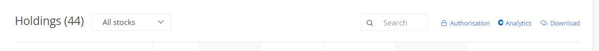

# HP_Calculator

A Simple Python Script to Caculated the Percentage of Amount Invested in each equity by parsing the holdings statement in csv format

This Script only works for Holding Statement from Zerodha (Use the Download option from the Kite Portal)

Edit the holdings.csv file if you want to recalculate your Percetage before making an Investement. Just Enter the Symbol of the stock under the column Instrument, enter the qunatity of stock you want to purchase under the column Qty. and lastly enter the price at which you wnat to buy that stock under the column Avg. cost

After entering these values in a new cell at the end in the csv file, re run the script to see the new percentages should you buy a new stock.
